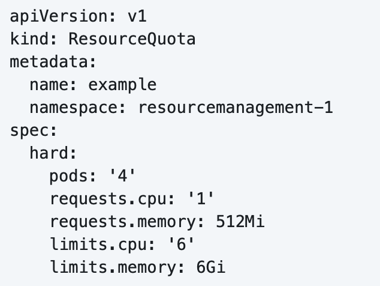
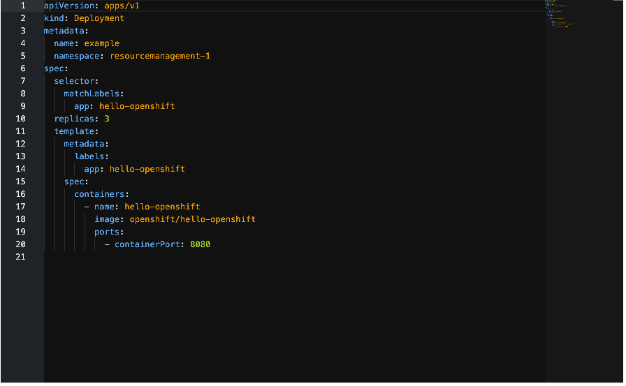
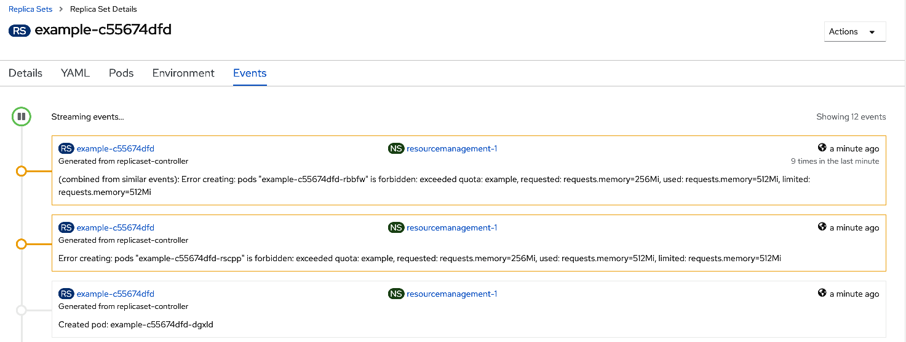
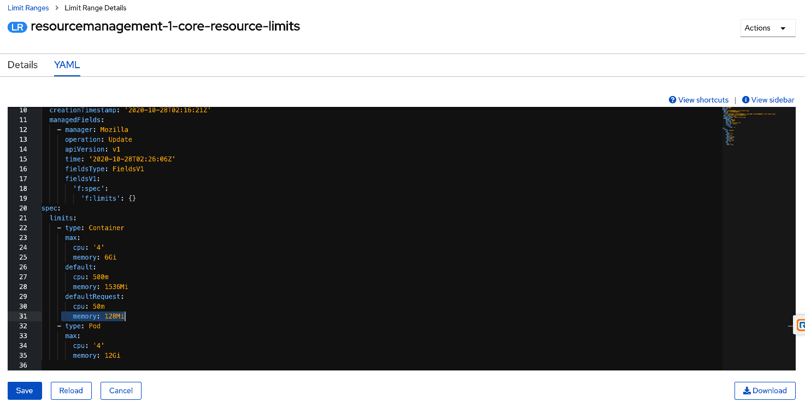

### Introduction

A resource quota provides constraints that limit aggregate resource consumption per project. 
It can limit the quantity of objects that can be created in a project by type, as well as the total amount of compute resources and storage that may be consumed by resources in that project.

A limit range restricts resource consumption in a project. 
In the project you can set specific resource limits for a Pod, container, image, image stream, or persistent volume claim (PVC).

### Configure Resource Quota

* Click on the `console`.

* Please switch project to `resourcemanagement-%username%`.  The user is assigned with cluster-admin role for this resourcemanagement-%username% project so that the user is able to create reource quota and limit range. 

* Navigate to **Administration** -> **Resource Quota** and click on **Create Resource Quota**.   Change the value of `requests.memory`, `limits.cpu` and `limits.memory` as below and click on **Create**


* Navigate to **Workload** -> **Deployments** and click on **Create Deployment**.   Accept the default and click on **Create**. 


* Navigate to **Workloads** -> **ReplicaSet** and click on `example-XXXXX`.   Please note that 2 pods are created successfully.  Let's look at why 3rd pod cannot be created.


* Click on **Event** tab.   Please note the error message as below.  It is due to the default limit range created for this project.   Let's look at the default limit range in subsequent steps.
``` 
Error creating: pods "example-c55674dfd-rbbfw" is forbidden: exceeded quota: example, requested: requests.memory=256Mi, used: requests.memory=512Mi, limited: requests.memory=512Mi
```


* Navigate to **Administration** -> **Limit Range**.   Please note that this limit range is created by default.   Click on `resourcemanagement-%username%-core-resource-limits`.


* Click on **Yaml** tab.   Change the **defaultRequest** -> **Memory** from `256Mi` to `128Mi`.  Click on **Save**. 


* Navigate to **Workloads** -> **ReplicaSet**.   Delete the replicaSet as shown below. 


* Please wait for a while.  3 pods will be created. 


### Summary
In this exercise, you have learned to create resource quota and limit range per project and how it affect the deployments.  
